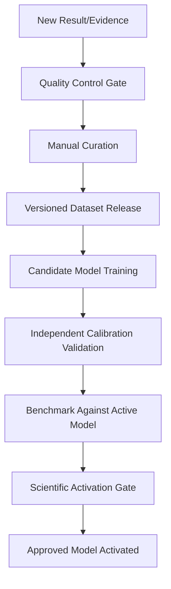

# DrugScreen360: Current-State & Gap Analysis

This document establishes the factual current state of the DrugScreen360 platform as of July 19, 2026, marking the start of **M1: Architecture Freeze**. It contains a comprehensive repository audit, an assessment of untracked files in the workspace, and maps the existing single-user local MVP capabilities onto the proposed five-module Biomedical Intelligence Platform future architecture.

---

## 1. Executive Summary

DrugScreen360 is currently a local research-use single-user MVP designed for computational compound screening, ADMET model preparation, external validation/calibration review, and Disease-to-Lead workflow orchestration. 

### Key Findings
- **Backend & Database**: A robust FastAPI backend utilizing a single SQLite database (`drugscreen360.sqlite3`). High test coverage (266 backend test cases).
- **Frontend**: A fully functional Single Page React Application built with Vite and TailwindCSS, but burdened by severe technical debt: the entire client-side interface resides in a single `App.jsx` file of over 500 KB (19,000+ lines of code).
- **ADMET & Modeling**: Capable of training local RandomForest and LogisticRegression models from uploaded datasets, parsing applicability domains, and computing expected calibration metrics on external validation datasets. However, it lacks generic out-of-the-box ML predictors; the "local_admet_model" is a placeholder configuration, and the "SHAP" feature explanation module is a simplified diagnostic coefficient/importance visualizer rather than a game-theoretic SHAP calculation.
- **External API Integrations**: PubChem (SMILES/CID resolution), ChEMBL (target search and candidate discovery), and Open Targets (disease target association) are successfully integrated with caching. BindingDB is a prototype webpage availability check only.
- **Scope Limitations**: Docking, molecular dynamics, generative molecule design, clinical validated prediction, and patient-specific precision medicine do **NOT** exist in the current codebase and are deferred.

---

## 2. Repository Architecture as It Exists Today

The project is structured as a monorepo containing a Python backend, a Vite/React frontend, and PowerShell startup/test scripts.

```text
drugscreen360/
├── backend/
│   ├── app/
│   │   ├── main.py (FastAPI application entrypoint)
│   │   ├── constants.py (Broad scientific disclaimers)
│   │   ├── database.py (SQLite connection and schema definition)
│   │   ├── models/ (Pydantic models and response schemas)
│   │   ├── routers/ (FastAPI API routes)
│   │   ├── services/ (Core business and computational logic)
│   │   └── demo_data/ (Pre-packaged CSV and JSON demo assets)
│   ├── tests/ (Pytest test suite)
│   ├── requirements.txt
│   └── pytest.ini
├── frontend/
│   ├── src/
│   │   ├── App.jsx (Single-file React application with all components)
│   │   ├── admetStudioApi.js (API client helper)
│   │   ├── main.jsx (Vite React entrypoint)
│   │   ├── styles.css (Vanilla styling overrides)
│   │   └── workflowUtils.js (Scoring, mapping, and step utility logic)
│   ├── package.json
│   └── tailwind.config.js
├── docs/ (Markdown guides and release documentation)
├── scripts/ (PowerShell operational utilities)
├── docker-compose.yml (Container orchestrator configuration)
└── VERSION (Project version metadata file)
```

---

## 3. Current Feature Inventory

The platform implements the following user-facing features:
1. **Single Molecule Screen**: Input a compound name, PubChem CID, SMILES, InChI, or InChIKey. Renders the 2D molecule using RDKit and calculates molecular weight, LogP, TPSA, HBD, HBA, and rotatable bonds, checking Lipinski and Veber rule compliance.
2. **Drug Finder**: Search ChEMBL targets by keyword, retrieve active compounds, rank them based on bioactivity concentration (IC50, Ki, EC50), and batch-screen them.
3. **Disease Finder**: Search Open Targets diseases, retrieve prioritized target proteins, and hand them directly into the ChEMBL candidate finder.
4. **ADMET Model Studio**: Step-by-step wizard to upload labelled CSV datasets, validate structure-label compatibility, train scikit-learn models (RF/LR) locally, review test-split metrics and model cards, validate and activate the generated model.
5. **External Validation & Calibration**: Upload a secondary, independent dataset to validate active models, computing expected calibration errors (ECE), Brier scores, and plotting calibration curves.
6. **Disease-to-Lead Stepper Workflow**: End-to-end workflow runner connecting target resolution, candidate discovery, similarity expansion, ADMET profiling, lead prioritization, assay planning, wet-lab feedback results loading, and reporting.
7. **Workspaces & Project Management**: Group screening outputs and workflow history under named project files, saved in SQLite.
8. **Document Export**: Local generation and download of JSON data packages, DOCX files (via `python-docx`), and PDF reports (via `ReportLab`).
9. **Research Export Packages**: Package database records, reports, configuration details, and system diagnostic status in a unified zip archive.
10. **System Readiness Panel**: A diagnostic check displaying versions, cache status, active model IDs, artifact directories, validation status, and next recommended actions.

---

## 4. Scientific Capability Inventory

To ensure scientific transparency, capabilities are categorized by their **Scientific Maturity**:

- **Established External Fact**: PubChem compound properties (e.g., molecular formula, IUPAC name) are retrieved directly from the NCBI database.
- **Database-Derived Evidence**: Target-to-disease association scores (Open Targets platform) and compound affinity measurements (ChEMBL database) are mapped directly to biological targets.
- **Computational Inference**: Molecular descriptors calculated locally using RDKit, Tanimoto similarity scores calculated using Morgan fingerprints (radius=2, 2048-bit), Lipinski/Veber rule evaluations, and target prioritization scoring.
- **Model Prediction**: ADMET/toxicity predictions generated by local RandomForest/LogisticRegression models trained in the ADMET Model Studio using scikit-learn.
- **Simulation**: *None.* No molecular docking, binding pose generation, or molecular dynamics simulations are supported.
- **Experimental Observation**: User-imported CSV files representing wet-lab confirmatory assays (measured concentrations, activity directions, replicate counts) compared against model predictions.
- **Clinically Validated Evidence**: *None.* The platform does not incorporate clinical trial success probabilities, patient genetics, patient-specific drug response, or efficacy predictions.

---

## 5. ML/Model Status

The machine learning subsystem is active but restricted to local, user-driven training:
- **Trained Model Registry**: Active models are tracked in the database and serialized using `joblib` into `backend/models/admet/trained/`. When activated, they provide predictions dynamically to the Disease-to-Lead final report.
- **Local ADMET Model Adapter (`local_admet_model.py`)**: A placeholder implementation that fails health checks unless an external predictor loader is integrated. It reports:
  `"Local model manifest/artifacts may be present, but no supported predictor implementation is active."`
- **Explainability**: Custom feature explanations represent global diagnostics (coefficient magnitudes or random forest feature importances) and are **NOT** game-theoretic SHAP local feature attributions.
- **Calibration**: Employs Platt scaling (for Logistic Regression) or random forest probability estimates to compute Expected Calibration Error (ECE) and Brier scores, warning users when models are poorly calibrated or overfitted.

---

## 6. Dataset Status

- **Curation**: ADMET Model Studio parses uploaded CSV files, checks SMILES validity via RDKit, identifies duplicate SMILES, maps binary labels (e.g., active/inactive, toxic/nontoxic), and outputs a structured validation summary.
- **Demo Assets**: Small demo files are stored inside `backend/app/demo_data/` to populate the demo workspace.
- **Trained Data Persistence**: Curated records are stored in the `admet_dataset_records` SQLite table, linking canonical SMILES to labels.

---

## 7. Evidence/Provenance Status

- **Evidence Quality Engine**: Evaluates ChEMBL bioactivity evidence. It extracts confidence scores, assay types, and potency units to classify candidates as having:
  - **Strong Evidence**: Low concentration (nM) assays with high confidence scores.
  - **Moderate/Weak Evidence**: Incomplete activity units, or assays with lower confidence.
  - **Uncertain Evidence**: Missing concentrations or mismatched target definitions.
- **Provenance Link**: Tracks raw compound and target ChEMBL IDs, linking them to source records.

---

## 8. Validation Status

- **Internal Validation**: Captured via the test-split metrics (Accuracy, Balanced Accuracy, Precision, Recall, F1, and ROC-AUC) saved inside the model card during training.
- **External Validation**: Run via the ADMET Model Studio. The system evaluates the active model against a user-uploaded labelled validation set, checks for data leakage (warnings are raised if validation SMILES overlap with training SMILES), and includes validation performance warnings in the final report.

---

## 9. Reporting Status

- **PDF Generation**: Handled programmatically using the `ReportLab` platypus layout.
- **DOCX Generation**: Built using the `python-docx` API.
- **Content Security**: All reports dynamically append a mandatory scientific notice:
  `"Computational decision-support report only. Experimental and clinical interpretation requires qualified scientific review."`
  and list explicit limitations regarding computational predictions.

---

## 10. Frontend/Workflow Status

- **UI Orchestration**: Built as a React single page application. Standalone tools (Single Molecule Screen, Drug Finder, Cache, Benchmarks) are grouped under the **Advanced Tools** dropdown.
- **Disease-to-Lead Stepper**: Coordinates the multi-step workflow. Users can navigate back and forth, loading target lists, discovering candidates, training/activating models, scoring leads, planning validation, entering lab results, and generating reports.
- **UI Debt**: 
  > [!WARNING]
  > The frontend lacks component modularity. `frontend/src/App.jsx` contains over 19,000 lines of code, combining state, UI layouts, formatting utilities, and inline charts. This represents a significant risk for scalability and developer onboarding.

---

## 11. Infrastructure/Deployment Status

- **Local Setup**: Operates on Python 3.12 and Node.js. 
- **Docker Integration**: Includes backend `Dockerfile` (using `python:3.12-slim`), frontend `Dockerfile` (using `node:22-alpine` for build, serving with `nginx:alpine`), and a root `docker-compose.yml` defining volume bindings for persistent database files.
- **CI Pipeline**: `.github/workflows/ci.yml` runs automatic checks: pytest backend execution, npm test, frontend build, and docker compose configuration validation on main-bound commits.

---

## 12. Untracked-Work Assessment

A detailed audit of the untracked files in the repository yields the following analysis:

1. **`backend/show_dataset_routes.py`**
   - *Purpose*: Introspects the FastAPI OpenAPI schema to find and print endpoints related to datasets, curation, and file uploading.
   - *Classification*: Temporary debugging utility. Can be deleted once the architecture freeze is lifted, as API Swagger docs (`/docs`) provide this view.
2. **`backend/show_dataset_upload_schema.py`**
   - *Purpose*: Extracts and prints JSON schemas of dataset upload request and response bodies.
   - *Classification*: Temporary debugging utility. Can be deleted.
3. **`backend/show_training_api_schema.py`**
   - *Purpose*: Introspects OpenAPI routes specific to ADMET training.
   - *Classification*: Temporary debugging utility. Can be deleted.
4. **`backend/show_training_body_schema.py`**
   - *Purpose*: Prints Pydantic schemas associated with model training runs.
   - *Classification*: Temporary debugging utility. Can be deleted.
5. **`data/` (Directory containing `clintox.csv`, `clintox.csv.gz`, and `drugscreen360_clintox_full_cttox.csv`)**
   - *Purpose*: Authentic ClinTox toxicity datasets mapping SMILES strings to binary toxicity concern flags. Used to train local models during testing and demonstration.
   - *Classification*: Dataset/training assets. They should be preserved and eventually migrated into a dedicated `backend/app/demo_data/` or a data package rather than sitting at the repository root.
6. **`run_v018_external_validation.py`**
   - *Purpose*: Script to post the smoke external validation dataset to the local FastAPI validation API (`/api/admet-validation/external/run`).
   - *Classification*: Temporary debugging utility / developer smoke-testing script. Keep outside production source packages but preserve in developer scripts.
7. **`upload_clintox_dataset.py`**
   - *Purpose*: Helper script that uploads the root ClinTox dataset to the local app API to initialize the training state.
   - *Classification*: Temporary debugging utility. Preserve in developer scripts.
8. **`v018_smoke_external_validation.csv` & `v018_smoke_external_validation_12.csv`**
   - *Purpose*: 5-record and 12-record toy CSV validation datasets containing chemical structures and binary labels used to test validation calibration.
   - *Classification*: Test/smoke data assets. Should be preserved and moved into a `tests/data/` directory.

---

## 13. Mapping into the Five-Module Future Architecture

To transition DrugScreen360 from an monolithic local MVP into the proposed modular Biomedical Intelligence Platform, current codebase components are mapped into five future modules plus shared infrastructure:

### A. Diagnosis & Mechanism Intelligence
Covers target discovery, target prioritizing, and disease-target associations.
- `backend/app/services/open_targets_service.py`
- `backend/app/services/target_ranker.py`
- `backend/app/routers/disease_finder.py`
- SQLite tables: `disease_searches`, `disease_target_results`

### B. Drug Discovery 360
Covers molecule screening, physicochemical descriptors, local ADMET predictions, structural alert filters, similarity Analog searches, and lead prioritization.
- `backend/app/services/descriptors.py`
- `backend/app/services/rules.py`
- `backend/app/services/admet_rules.py`
- `backend/app/services/admet_toxicity_engine.py`
- `backend/app/services/toxicity_rules.py`
- `backend/app/services/similarity_service.py`
- `backend/app/services/chembl_service.py`
- `backend/app/services/admet_predictor_service.py`
- `backend/app/services/admet_trained_model_service.py`
- `backend/app/services/admet_lead_service.py`
- `backend/app/services/candidate_ranker.py`
- SQLite tables: `screening_history`, `finder_searches`, `finder_candidates`, `similarity_searches`, `similarity_candidates`, `model_prediction_logs`, `admet_lead_prioritization_runs`, `admet_lead_prioritization_candidates`, `admet_model_evidence_runs`, `admet_model_evidence_candidates`

### C. Precision Medicine
Covers patient-specific genomic analyses, patient-specific targets, and clinical cohort matching.
- *Currently missing.* (No files represent this module yet; deferred to post-M1 phases).

### D. Laboratory Intelligence
Covers experimental validation planners and wet-lab results feedback imports.
- `backend/app/services/validation_planner_service.py`
- `backend/app/services/experimental_results_service.py`
- SQLite tables: `experimental_validation_plans`, `experimental_validation_plan_candidates`, `experimental_result_batches`, `experimental_results`, `prediction_feedback_summaries`

### E. Evidence & Learning Core
Covers bioactivity quality scoring, dataset curation, local training loops, external model validation metrics, and model activation gates.
- `backend/app/services/evidence_quality.py`
- `backend/app/services/admet_dataset_service.py`
- `backend/app/services/admet_training_service.py`
- `backend/app/services/admet_validation_service.py`
- `backend/app/services/model_registry.py`
- `backend/app/services/admet_model_evidence_resolver.py`
- `backend/app/services/cache_service.py`
- `backend/app/services/bindingdb_service.py` (Currently a prototype probe only)
- SQLite tables: `admet_datasets`, `admet_dataset_records`, `admet_training_runs`, `admet_model_artifacts`, `admet_active_model`, `admet_external_validation_runs`, `admet_external_validation_records`, `api_cache`

### F. Shared Platform Infrastructure
Covers databases, FastAPI routing core, document reporting, workspace history, and system readiness.
- `backend/app/main.py`
- `backend/app/database.py`
- `backend/app/services/final_report_service.py`
- `backend/app/services/reports.py`
- `backend/app/services/project_workspace_reports.py`
- `backend/app/services/research_export_service.py`
- `backend/app/services/project_workspace_service.py`
- `backend/app/services/history.py`
- `backend/app/services/version.py`
- SQLite tables: `projects`, `project_items`, `project_exports`, `project_workspace_reports`, `project_active_option`, `research_exports`

---

## 14. Critical Architecture Problems

1. **Monolithic Frontend React Structure**: Having all screens, state management, stepper workflows, and layouts packed inside one 500 KB `App.jsx` file blocks collaborative development, slows down IDE parsers, and makes the UI fragile.
2. **SQLite Concurrent Limitations**: A local SQLite file-based database is sufficient for single-user research desktop use, but lacks transaction isolation, high-throughput concurrency, or row-level permissions required for clinical or multi-user enterprise servers.
3. **Implicit Dependencies in Workflow Orchestrator**: The `disease_to_lead_service.py` file has direct imports to services across all modules, creating a highly coupled circular structure instead of using a decoupled event-driven or decoupled task-orchestrator pattern.
4. **Synchronous Computational Tasks**: ADMET model training and external validation datasets are evaluated synchronously in FastAPI requests. If a user uploads a large dataset, it could block the event loop or trigger HTTP gateways timeouts.

---

## 15. Missing Capabilities

1. **3D Molecular Docking**: No structural binding pose generators, molecular docking scoring, or binding pocket evaluations exist.
2. **Molecular Dynamics (MD) Simulation**: No physics-based protein-ligand trajectory calculations, force-field evaluations, or structural flexibility assessments.
3. **De Novo Molecule Generation**: No AI-driven generative chemistry, RL-based lead optimization, or molecule generation models.
4. **Precision Medicine / Patient-Specific Analysis**: Complete lack of genomics integration, mutation profiling, patient-specific targets, or clinical cohort matching.
5. **Role-Based Authentication and Multi-User Isolation**: Single-user local setup. No user logins, encryption keys, or multi-tenant database isolation.

---

## 16. Technical Debt

1. **BindingDB Service Mocking**: `bindingdb_service.py` performs a simple webpage check to return a boolean status flag. It does not parse or query any affinity data.
2. **Missing Local Predictor Implementation**: `local_admet_model.py` validates the manifest and artifacts but fails to implement a real local scikit-learn predictor loading pipeline for pre-built models.
3. **SHAP Explanation Simplification**: The platform reports SHAP feature explanations, but the backend implementation in `admet_explain_service.py` only extracts linear model coefficients or global random forest feature importances. No game-theoretic SHAP local values are computed.
4. **Inline Styles and Hardcoded Colors**: The frontend CSS and Tailwind utilities are heavily hardcoded inside `App.jsx`, making themes or uniform design system updates difficult.

---

## 17. Scientific Risks

- **Descriptor-based ML Generalization**: Local models are trained using simple, low-dimensional 1D/2D descriptors (MW, LogP, TPSA, ring count, etc.). These baseline models may overfit on dataset biases and are highly likely to generalize poorly to novel scaffold classes compared to graph neural networks or 3D structural embeddings.
- **Model Overfitting and Leakage**: Inexperienced users may upload external validation datasets that overlap significantly with training data, generating high metrics that lead to false safety or efficacy confidence.
- **Misinterpretation of Explainability**: Global feature importances are shown to users as query-specific prediction explanations. Users might mistake these model diagnostic markers for causal biological mechanisms.

---

## 18. Features That Must NOT Be Claimed as Real Yet

To maintain compliance and scientific integrity, the following capabilities must **NOT** be advertised or claimed as implemented:
- Real-time binding affinity or docking calculations.
- De novo molecule optimization or novel scaffold generation.
- Real SHAP-based local explainability.
- Multi-user data security or clinical HIPAA compliance.
- Generalizability of trained local models beyond the uploaded curation datasets.
- Automatic model retraining (the platform must strictly adhere to the controlled loop below).

---

## 19. Assets We Should Preserve

- **Evidence Quality Engine (`evidence_quality.py`)**: A transparent, well-coded heuristic for scoring bioactivity measurements.
- **Platt-scaled Calibration Validation (`admet_validation_service.py`)**: The calibration binning, Brier score, and expected calibration error calculations are mathematically robust and must be preserved.
- **API Cache Engine (`cache_service.py`)**: SQLite-based caching prevents redundant external server hits and rate-limiting blocks during target searches.
- **Pytest Suite (`backend/tests/`)**: A extensive, robust suite of 266 backend integration tests that must remain green.

---

## 20. Recommended Architecture Decisions for M1

### Decision 1: Controlled Model Retraining and Activation Loop
The future system must enforce a controlled loop. Automatic model retraining from user feedback is **denied**.


### Decision 2: Frontend Deconstruction Plan
The M1 milestone should freeze frontend additions and schedule a complete extraction of components from `App.jsx` into modular directories:
- `components/diagnosis/` (Open Targets disease finder)
- `components/discovery/` (ChEMBL molecule finder, descriptors, predictions)
- `components/laboratory/` (Validation planners, CSV loaders)
- `components/governance/` (Model cards, calibrations, dataset curation)
- `components/shared/` (Layouts, panels, reporting)

### Decision 3: Service Package Directory Restructuring
Group FastAPI routers, Pydantic schemas, and backend services into package directories corresponding to the five modules (A, B, C, D, E) to prepare for the final modular architecture.

---

## 21. Capability Mapping and Audit Matrix

| Capability | Current Location | Current Status | Scientific Maturity | Future Module | Keep/Refactor/Move/Replace/Remove/Defer | Notes |
| :--- | :--- | :--- | :--- | :--- | :--- | :--- |
| **Physicochemical Descriptors** | `backend/app/services/descriptors.py` | IMPLEMENTED | computational inference | B. Drug Discovery 360 | Keep | Core RDKit-based profiling. |
| **Drug-Likeness Rules** | `backend/app/services/rules.py` | IMPLEMENTED | computational inference | B. Drug Discovery 360 | Keep | Lipinski and Veber rule compliance. |
| **Rule-Based ADMET Triage** | `backend/app/services/admet_toxicity_engine.py` | PARTIALLY IMPLEMENTED | computational inference | B. Drug Discovery 360 | Refactor | Active for absorption/solubility; CYP/hERG/Ames are static warnings. |
| **Trained Local ADMET Predictor** | `backend/app/services/admet_predictor_service.py` | IMPLEMENTED | model prediction | B. Drug Discovery 360 | Refactor | Supports local scikit-learn models; generic local predictor is missing. |
| **Dataset Upload & Curation** | `backend/app/services/admet_dataset_service.py` | IMPLEMENTED | experimental observation | E. Evidence & Learning Core | Move | Curation of structures and labels. |
| **Local Model Training** | `backend/app/services/admet_training_service.py` | IMPLEMENTED | computational inference | E. Evidence & Learning Core | Move | Models (RF/LR) serialization to joblib. |
| **Calibration & Validation** | `backend/app/services/admet_validation_service.py` | IMPLEMENTED | computational inference | E. Evidence & Learning Core | Move | Independent metrics and calibration curves. |
| **Feature Explanations** | `backend/app/services/admet_explain_service.py` | MOCK/SIMULATED | computational inference | E. Evidence & Learning Core | Refactor | Simplified diagnostics; not a real SHAP local calculation. |
| **Model Registry** | `backend/app/services/model_registry.py` | IMPLEMENTED | computational inference | E. Evidence & Learning Core | Move | Adapter management and model status tracking. |
| **Target Discovery** | `backend/app/services/open_targets_service.py` | IMPLEMENTED | database-derived evidence | A. Diagnosis & Mechanism Intelligence | Move | GraphQL Open Targets target association queries. |
| **Candidate Discovery** | `backend/app/services/chembl_service.py` | IMPLEMENTED | database-derived evidence | B. Drug Discovery 360 | Refactor | Target-bound molecule retrieval from ChEMBL. |
| **Evidence Quality Scoring** | `backend/app/services/evidence_quality.py` | IMPLEMENTED | computational inference | E. Evidence & Learning Core | Move | Scoring bioactivity measurement provenance. |
| **Lead Prioritization** | `backend/app/services/admet_lead_service.py` | IMPLEMENTED | computational inference | B. Drug Discovery 360 | Refactor | Ranks candidates based on scoring profiles. |
| **Validation Planner** | `backend/app/services/validation_planner_service.py` | IMPLEMENTED | computational inference | D. Laboratory Intelligence | Move | Directs wet-lab assay recommendations. |
| **Experimental Feedback** | `backend/app/services/experimental_results_service.py` | IMPLEMENTED | experimental observation | D. Laboratory Intelligence | Move | Compares wet-lab CSV data against model output. |
| **PDF/DOCX/JSON Reporting** | `backend/app/services/final_report_service.py` | IMPLEMENTED | computational inference | F. Shared Platform Infrastructure | Keep | Outputs document reports. |
| **Research Export** | `backend/app/services/research_export_service.py` | IMPLEMENTED | computational inference | F. Shared Platform Infrastructure | Keep | Zips workspace databases, logs, and files. |
| **Project Workspaces** | `backend/app/services/project_workspace_service.py` | IMPLEMENTED | computational inference | F. Shared Platform Infrastructure | Keep | Manages project workspace sessions. |
| **Workflow Orchestration** | `backend/app/services/disease_to_lead_service.py` | IMPLEMENTED | computational inference | F. Shared Platform Infrastructure | Refactor | Disease-to-Lead orchestrator; highly coupled. |
| **System Diagnostics** | `backend/app/routers/health.py` | IMPLEMENTED | computational inference | F. Shared Platform Infrastructure | Keep | Version, status, readiness metrics. |
| **Vite/React Client SPA** | `frontend/src/App.jsx` | PARTIALLY IMPLEMENTED | computational inference | F. Shared Platform Infrastructure | Refactor | High technical debt. Single file React UI. |
| **BindingDB Live Probe** | `backend/app/services/bindingdb_service.py` | PROTOTYPE | computational inference | E. Evidence & Learning Core | Replace | Simple check of BindingDB webpage check. |
| **Molecular Docking** | None | MISSING | simulation | B. Drug Discovery 360 | Defer | Placeholder / not implemented in MVP. |
| **Molecular Dynamics** | None | MISSING | simulation | B. Drug Discovery 360 | Defer | Not implemented in MVP. |
| **Generative Molecule Design** | None | MISSING | model prediction | B. Drug Discovery 360 | Defer | Not implemented in MVP. |
| **Precision Medicine** | None | MISSING | clinically validated evidence | C. Precision Medicine | Defer | Not implemented in MVP. |
| **Authentication & Isolation** | None | MISSING | computational inference | F. Shared Platform Infrastructure | Defer | Single-user local setup. Multi-user security deferred. |
